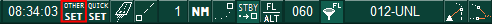
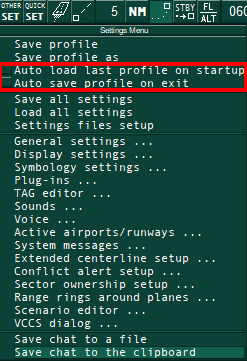

!!! tip "Важно"
    Перед установкой EuroScope **<u>обязательно</u>** скачайте **[Microsoft Visual C++ Redistributable](https://aka.ms/vs/17/release/vc_redist.x86.exe)** он необходим для корректной работы EuroScope и его компонентов

## Установка EuroScope {#installation}

Мы рекомендуем скачивать [Euroscope v3.2.3.2](https://euroscope.hu/install/EuroScopeSetup.3.2.3.2.msi)

Установка EuroScope очень проста. Просто следуйте инструкциям установщика.

??? question "Мне нужна помощь"

    Откройте установщик и нажмите кнопку `Next`.

    

    Когда кнопка `Next` исчезнет, нажмите `Close`, чтобы выйти из установщика.

## Первый запуск EuroScope {#fist-start}

При первом запуске <u>**обязательно**</u> проверьте настройки в меню `OTHER SET`

Окно `OTHER SET` находится на верхней панели EuroScope, справа от времени

Там **<u>не должно быть</u>** галочек напротив:
    
- `Auto load last profile on startup`
- `Auto save profile on exit`   

{ width="250" }

Если они установлены, снимите их, сохраните изменения и перезапустите EuroScope
    
??? question "Не могу найти меню `OTHER SET`"
    Скорее всего, необходимые настройки уже установлены, и перед вами автоматически открылось окно выбора профиля

    <u>**Закройте**</u> это окно и перейдите в `OTHER SET`, чтобы проверить настройки 

## Следующий шаг {#next-step}
Далее необходимо скачать сектор-файл

Как правильно его установить описано в [Cектор-файл](sector-file.md)