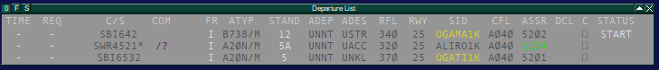

# Departure List {#departure-list}

| Элемент 	|                  Описание                 	|                         ЛКМ                        	|                         ПКМ                        	|
|:-------:	|:-----------------------------------------:	|:--------------------------------------------------:	|:--------------------------------------------------:	|
|   TIME  	|           Время ожидания запроса          	|                Открыть меню запросов               	|                Открыть меню запросов               	|
|   REQ   	|              Ожидающий запрос             	|                Открыть меню запросов               	|                Открыть меню запросов               	|
|    CS   	|                  Позывной                 	|       Открыть окно передачи/приёма управления      	|     Открыть список выбора следующего диспетчера    	|
|   COM   	|              Тип коммуникации             	|        Открыть окно выбора типа коммуникации       	|        Открыть окно выбора типа коммуникации       	|
|    FR   	|                 Тип полёта                	|                          —                         	|                          —                         	|
|   ATYP  	|            Тип воздушного судна           	|                          —                         	|                          —                         	|
|  STAND  	|                  Стоянка                  	|                          —                         	|                          —                         	|
|   ADEP  	|              Аэродром вылета              	|                 Открыть план полёта                	|       Включить/выключить отображение маршрута      	|
|   ADES  	|             Аэродром прибытия             	|                 Открыть план полёта                	|       Включить/выключить отображение маршрута      	|
|   RFL   	|        Запрашиваемый эшелон полёта        	|                          —                         	|                          —                         	|
|   RWY   	|                    ВПП                    	|               Открыть меню выбора ВПП              	|               Открыть меню выбора ВПП              	|
|   SID   	|             Схема вылета (SID)            	|          Открыть меню выбора схемы вылета          	|          Открыть меню выбора схемы вылета          	|
|   CFL   	| Разрешённый эшелон (первоначальный набор) 	|       Открыть меню выбора назначенной высоты       	|       Открыть меню выбора назначенной высоты       	|
|   ASSR  	|             Код ВОРЛ (Squawk)             	|          Открыть меню назначения кода ВОРЛ         	|          Открыть меню назначения кода ВОРЛ         	|
|   DLC   	|                     —                     	| Установить отметку о получении разрешения на вылет 	| Установить отметку о получении разрешения на вылет 	|
|    C    	|  Отметка о получении разрешения на вылет  	| Установить отметку о получении разрешения на вылет 	| Установить отметку о получении разрешения на вылет 	|
|  STATUS 	|             Статус ВС на земле            	|           Открыть меню выбора статуса ВС           	|           Открыть меню выбора статуса ВС           	|