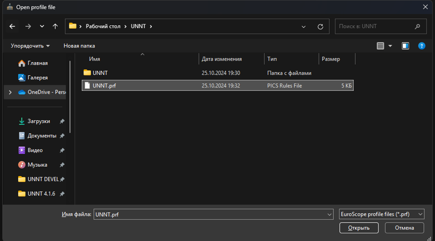

!!! danger "Внимание!"
    **<u>Запрещено</u>** хранение использованного вами сектор-файла в сервисах облачного хранения, **<u>передача</u>** и другое перемещение папки с сектор-файлом из вашего ПК.

## Подготовка к установке {#preparation}
Для начала необходимо создать папку, в которой будет храниться сектор-файл и его файлы.

Создайте папку с названием `UNNT` в любом удобном месте.

Мы рекомендуем использовать следующий путь: `...\Рабочий стол\UNNT`

## Установка сектор-файла {#instalation}
!!! warning "Обратите внимание"
    Актуальная версия сектор-файла доступна для скачивания **ТОЛЬКО** на сайте [https://files.aero-nav.com/UNNT](https://files.aero-nav.com/UNNT)

    На этом сайте указана версия AIRAC, дата последнего релиза и актуальная версия сектор-файла.

1. Перейдите на [страницу загрузки сектор-файла](https://files.aero-nav.com/UNNT)
2. Войдите в систему, используя свою учётную запись VATSIM/Navigraph
3. Скачайте ZIP-архив с названием `UNNT_Install_Package`
4. Распакуйте содержимое архива в созданную ранее папку `UNNT`

После распаковки сектор-файла можно запустить EuroScope

При запуске перед вами появится окно выбора профиля.
В этом окне откройте папку, в которую вы распаковали сектор-файл

Выберите файл с расширением `.prf` и нажмите `Открыть`

## Обновление сектор-файла {#updating}

<!-- 

После создания папки распаковать архив в нее.
Если у вас уже была установлена предыдущая версия сектор-файла, то ее необходимо **полностью удалить**.

 **[Сектор-файл](https://files.aero-nav.com/)** -->